# customReadmeSVG

Dynamic, extensible SVG card generator for GitHub profile READMEs, powered by the GitHub GraphQL API, Axios, and a pluggable cache engine.


---

## 🚀 Overview & Features

`customReadmeSVG` generates dynamic, customizable SVG cards designed for embedding directly in your GitHub profile `README.md`.

* **Extensible Plugin Registry**: Easily register custom card plugins conforming to a simple `CardPlugin` contract.
* **GraphQL Data Layer**: Efficiently fetches profile, repository, language byte count, and metric data via GitHub GraphQL API.
* **Pluggable Caching**: Built-in memory cache engine with customizable TTLs to stay well within GitHub API rate limits.
* **Dev Server Middleware**: Seamless local development experience serving raw SVG requests directly via Vite dev server.
* **Theme System**: Supports built-in color themes (`dark`, `light`, `radical`, `nord`, `gruvbox`, `dracula`).

---

## 📌 Available SVG Routes & Embed Examples

### Routes

| Route | Card Plugin | Default TTL | Description |
|---|---|---|---|
| `/:user` or `/:user/profile` | Profile Overview | 1 Hour | Name, bio, repository count, follower/following counts, location, & company |
| `/:user/languages` | Top Languages | 6 Hours | Top 5–8 programming languages aggregated by byte size with color dots & percentages |
| `/:user/repos` | Top Repositories | 2 Hours | Top 6 public non-fork repositories ordered by stargazers |
| `/:user/stats` | GitHub Stats | 1 Hour | Total stars earned, total forks, commit contributions, repo count, & followers |
| `/:user/banner` | 2D Platformer Adventure Banner | 2 Hours | Interactive 2D pixel-art platformer with project buildings, collectable skill orbs, and fox gameplay |

### Query Parameters

* `theme`: `dark` | `light` | `radical` | `nord` | `gruvbox` | `dracula` (Default: `dark`)
* `cache`: Set `?cache=0` to bypass server-side cache.

### Markdown Embed Examples

```markdown
<!-- Looping 2D Platformer Adventure Banner (Static SVG from repository) -->


<!-- Dynamic Live Netlify Serverless Banner Route -->


<!-- Profile Overview -->


<!-- Top Languages -->


<!-- Top Repositories -->


<!-- GitHub Stats -->

```

---

## 🔑 Token & Environment Setup

The GitHub GraphQL API requires authentication. Set your Personal Access Token in `.env`:

```bash
# Copy env template
cp .env.example .env
```

Add your token:
```env
GITHUB_TOKEN=ghp_your_github_personal_access_token
# or for Vite environment loading
VITE_GITHUB_TOKEN=ghp_your_github_personal_access_token
```

When running locally with GitHub CLI (`gh`), you can pass your authenticated token directly:

```bash
export GITHUB_TOKEN=$(gh auth token)
npm run dev
```

---

## 🧩 Adding a Custom Card Plugin

To create a new card plugin, implement the `CardPlugin` interface and register it in `src/cards/index.js`:

```javascript
// src/cards/my-custom-card/index.js
import { registerCard } from '../../core/cards/registry.js';
import { graphql } from '../../core/github/client.js';

export const myCustomCard = {
  id: 'my-card',
  title: 'My Custom Card',
  aliases: ['custom'],
  cacheTtlMs: 3600000, // 1 hour in ms

  async fetchData(username, options = {}) {
    const data = await graphql(MY_QUERY, { login: username }, options);
    return normalizeMyData(data);
  },

  renderSvg(data, theme, options = {}) {
    return `<svg xmlns="http://www.w3.org/2000/svg" width="400" height="150">
      <rect width="400" height="150" fill="${theme.bg}" />
      <text x="20" y="40" fill="${theme.title}">${data.title}</text>
    </svg>`;
  },
};

// Register in registry
registerCard(myCustomCard);
```

---

## ⚡ Hosting Architecture & Deployment Notice

### GitHub Pages vs Dynamic SVG Generation

* **GitHub Pages**: Static site host. Used in this repo to publish the interactive **Card Playground SPA**. Static Pages cannot execute per-request GraphQL queries or dynamic SVG parameters (`?theme=...`).
* **Dynamic SVG Serving**: Dynamic SVG routes (`/:user`, `/:user/languages`, etc.) are processed on-demand via the pure request handler `handleRequest` in `src/runtime/handleRequest.js`.
* **Deployment Options**:
  1. **Vite Middleware**: Serves dynamic SVGs during local development (`npm run dev`).
  2. **Edge / Serverless Host**: Import `handleRequest` directly into Cloudflare Workers, Vercel Edge Functions, or Node.js serverless handlers for live production README embeds.

---

## 🛠️ Local Development

```bash
# Install dependencies
npm install

# Start Vite dev server with SVG route middleware
export GITHUB_TOKEN=$(gh auth token)
npm run dev

# Test SVG endpoint in terminal
curl -s http://localhost:5173/octocat/stats | head -n 20
curl -s http://localhost:5173/octocat/banner | head -n 20

# Generate standalone animated banner SVG locally
npm run generate:banner -- --user=octocat

# Build production SPA bundle for GitHub Pages
npm run build
```

---

## 🦊 Automated Banner Regeneration (GitHub Actions)

Since GitHub strips `<script>` tags and README `` tags cannot make dynamic GraphQL API calls at view-time:

1. **Scheduled Cron**: The `.github/workflows/generate-banner.yml` workflow runs automatically twice daily (`0 0,12 * * *`).
2. **GraphQL Query**: Queries GitHub's GraphQL API for the user's pinned and top repositories.
3. **Pure SMIL Generation**: Compiles the pixel-art fox walk cycle, neon signposts, and parallax cityscape into pure SMIL `<animate>` and `<animateTransform>` tags.
4. **Auto-Commit**: Automatically commits and pushes the updated `banner.svg` to the repository root. GitHub re-renders the updated static file with zero external runtime dependencies.
